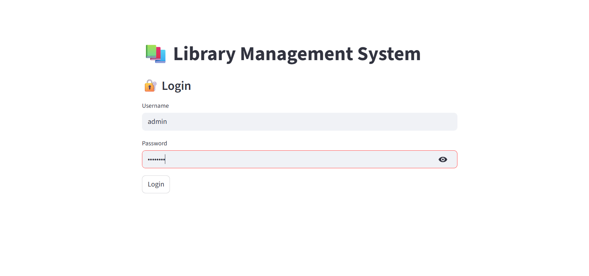
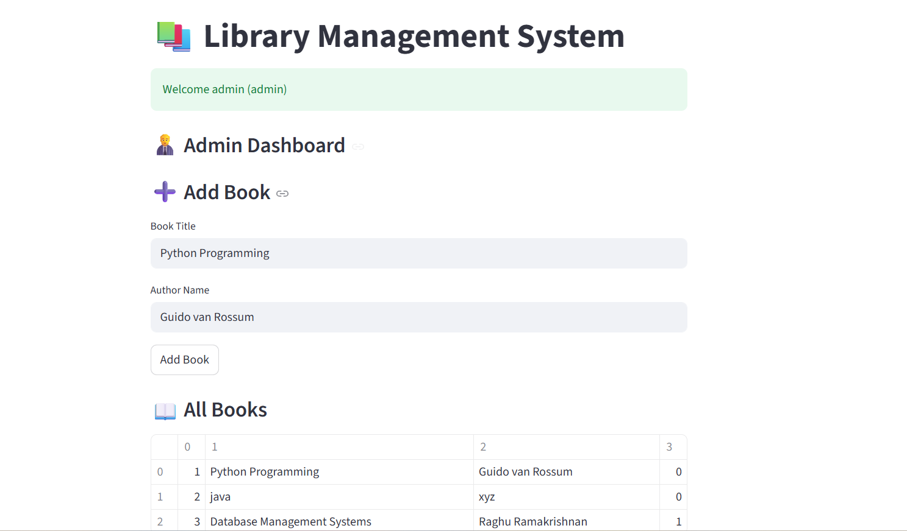
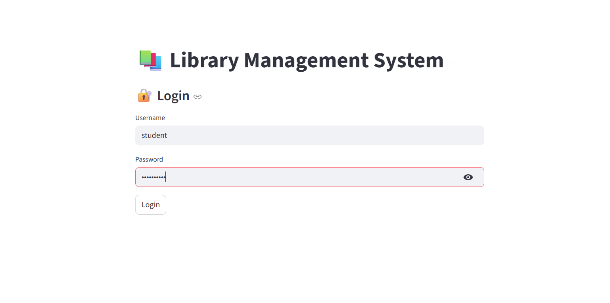
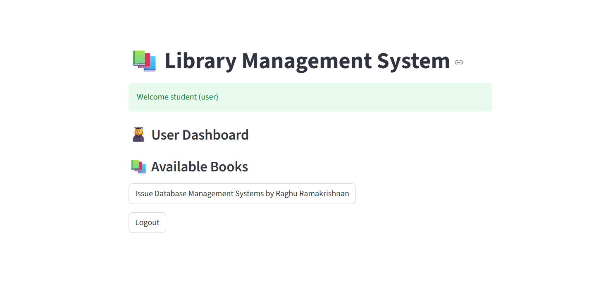

# Library Management System

A role-based Library Management System developed using **Python**, **Streamlit**, and **SQLite**.  
This project automates book management, issue tracking, and user access through a simple and clean interface.

---

## Project Overview

- **Admin** can add books and view all books.  
- **User** can view available books and issue them.  
- Book availability updates automatically when issued.  
- Demonstrates authentication, CRUD operations, and database handling.

---

## Demo Output

> The above demo shows:
> - Admin dashboard with book addition  
> - User dashboard with available books  
> - Issuing a book updates availability  

---

## Technologies Used

- Python  
- Streamlit  
- SQLite  

---

## Default Login Credentials

**Admin:**  
- Username: admin  
- Password: admin123  

**User:**  
- Username: student  
- Password: student123  

---

## How to Run the Project

1. Install dependencies:

``bash
pip install -r requirements.txt

2.Run the application:

streamlit run app.py

## Project Demo

**Future Enhancements**

Book return with fine calculation

Password hashing for security

Search & filter books

Dashboard analytics

 *Author*

Natasha Madurai

This project is developed for academic purposes and demonstrates SDLC implementation, database management, and role-based access control.